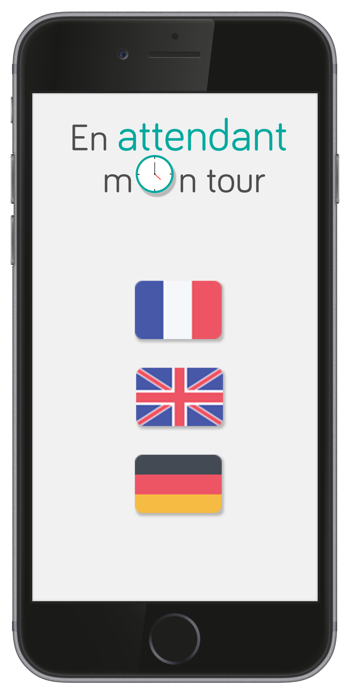
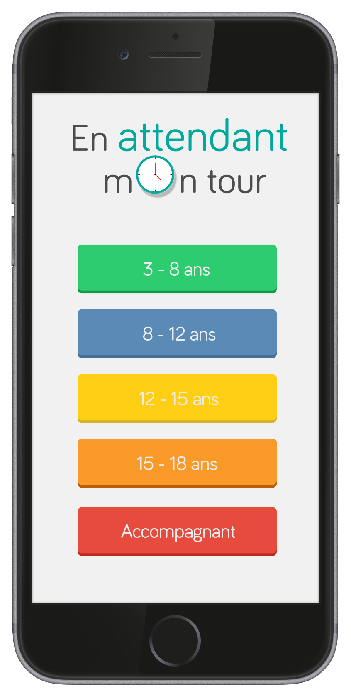
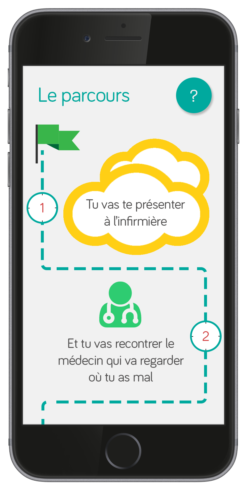
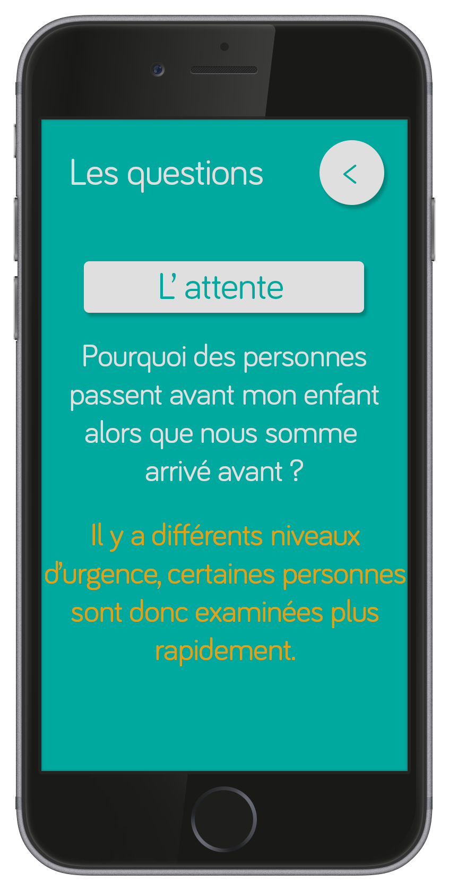

# EnAttendantMonTour
Application destinée à rassurer les enfants et leurs parents dans les urgences pédiatriques en les accompagnants dans leur parcours de soin et répondant aux questions les plus posées de manière à réduire les interruptions de travail du personnel soignant et améliorer l'ambiance des salles d'attente.

## Les images suivantes sont à titre d'exemple, elles servent à matérialiser le premier prototype 

